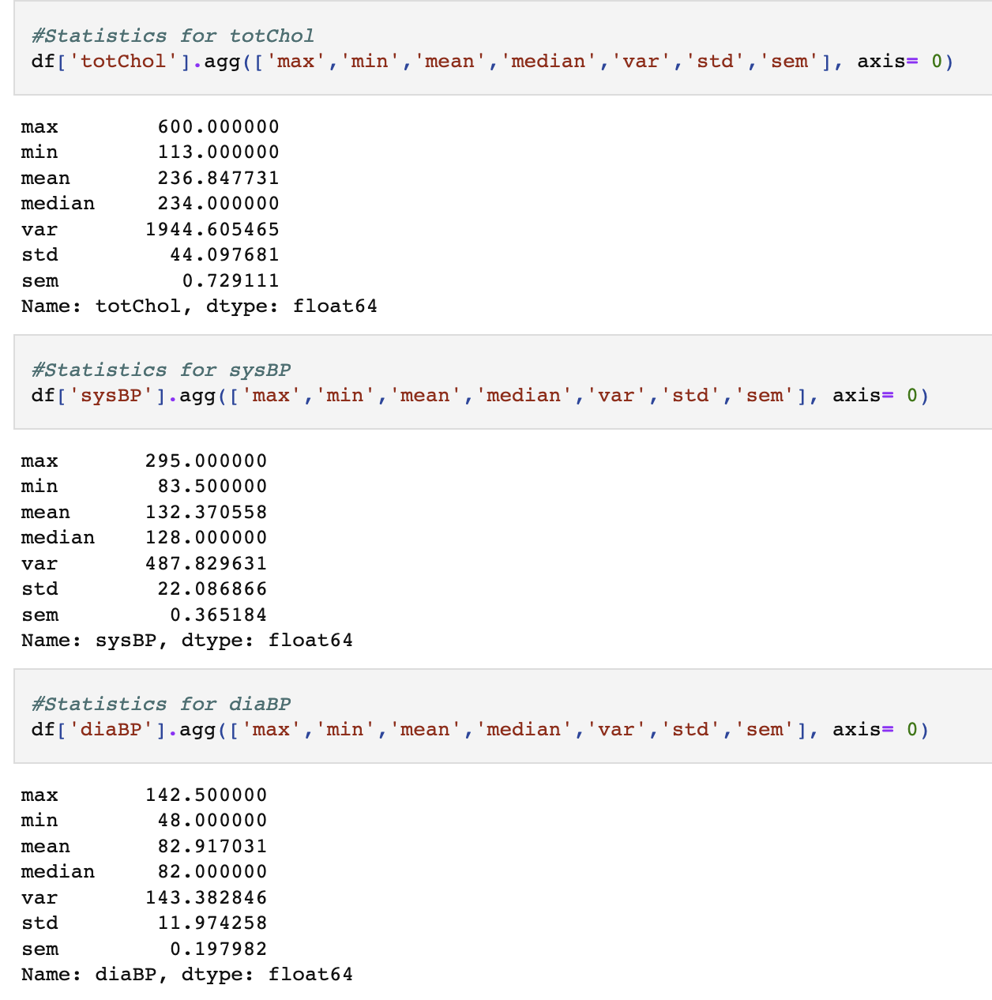
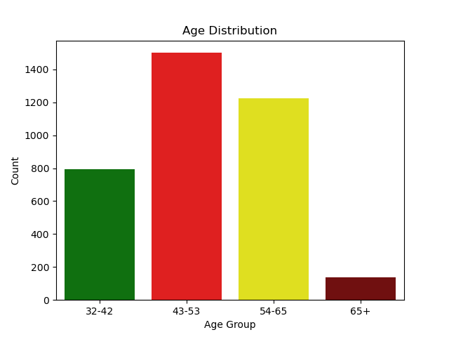
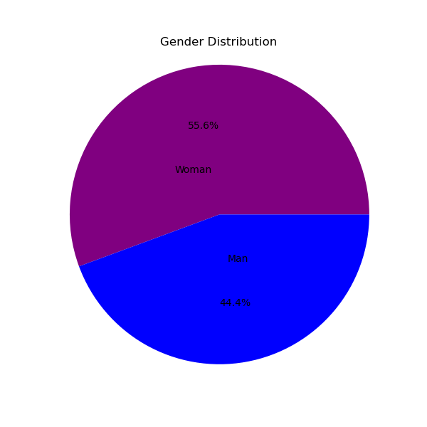
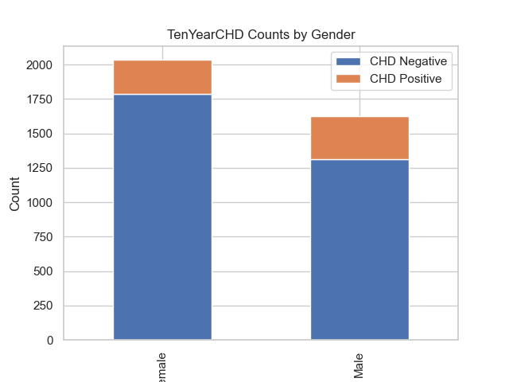
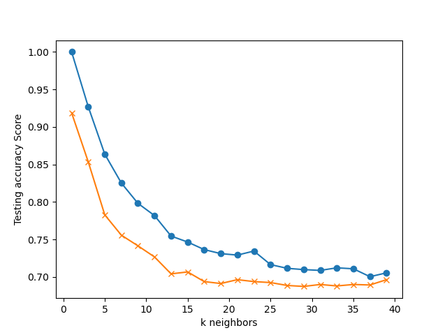

# Coronary Heart Disease Predictor

# Overview
This project aims to predict the ten-year risk of Coronary Heart Disease (CHD) using the Framingham Heart Study dataset. It includes an exploratory data analysis (EDA) of the dataset, data preprocessing steps, descriptive statistics, and visualizations. Additionally, a predictive model based on Random Forest has been implemented to accurately classify patients based on their risk of CHD.

## Dataset
The dataset used for this project is the Framingham Heart Study dataset, a well-known dataset widely used in cardiovascular research. It contains various patient features, such as age, gender, cholesterol levels, blood pressure, and other risk factors associated with CHD. The dataset is available at https://www.kaggle.com/datasets/aasheesh200/framingham-heart-study-dataset?resource=download.

# Exploratory Data Analysis
During the EDA phase, the dataset was carefully analyzed to gain insights into its structure and identify any initial trends or patterns. This involved examining the distributions of variables, identifying missing values, and understanding the relationships between different features. The initial analysis helped in understanding the dataset better and guided the subsequent preprocessing steps.

## Data Preprocessing
Data preprocessing is an essential step in preparing the dataset for analysis and modeling. In this project, the dataset was cleaned by removing null values and duplicates. These missing values and duplicates could potentially impact the accuracy and reliability of the predictive model. By performing thorough data preprocessing, we ensured the dataset's quality and reliability for further analysis.

## Descriptive Statistics
To gain a better understanding of the dataset, descriptive statistics were calculated for each variable. These statistics included measures such as mean, median, standard deviation, minimum, and maximum values. Descriptive statistics help in summarizing the dataset and provide insights into the range and distribution of different features.

## Visualizations
Visualizations play a crucial role in understanding data and conveying meaningful insights effectively. In this project, various visualizations were created to explore different aspects of the dataset. This includes gender distributions, age distributions, and other relevant visualizations. The visualizations aided in identifying patterns, trends, and potential relationships between variables.

# Predictive Model
The primary objective of this project was to develop a predictive model to determine the ten-year risk of CHD. Initially, a K-Nearest Neighbors (KNN) model was implemented, but it was later replaced with a Random Forest model due to its superior performance. The Random Forest model showed an accuracy of 95% in classifying patients based on their CHD risk.

## Preprocessing
There were multiple steps taken to preprocess the data for the training and testing sets:
1. Create variables for the features and the target. The target was the TenYearCHD column and all the other columns were the features.
2. The original dataset was unbalanced, so we used the RandomOverSampler to make the target balanced
3. Selected the 10 best features using the chi2 test
4. Finally, we normalized the data using the MinMaxScaler

## KNN Model
In order to determine the optimal number of neighbors for our KNN model, we conducted an experiment by iterating through different values of k. We trained and tested the model with different k values to assess their impact on the accuracy of the predictions.
By varying the k value from 1 to 39 (with an increment of 2), we plotted the training and testing accuracy scores. The resulting line chart provides a visual representation of the accuracy scores for different numbers of neighbors.

From the chart, we observed that a k value of 2 yielded the best results. Although using 1 neighbor achieved high accuracy on the training data, it seemed to be overfitting the model.

After finding the k value, we checked the accuracy of the model and it was around 90%.

## Random Forest Model
While the accuracy for the KNN model was high, we aimed for a score of over 95% so we trained on a Random Forest model.
To optimize the performance of the Random Forest model, we utilized a grid search approach to find the best combination of hyperparameters. The parameter grid consisted of different values for the number of estimators (n_estimators). 
By performing the grid search, we determined the best hyperparameters for the Random Forest model. These hyperparameters were then used to train the Random Forest model with the optimized settings.

Subsequently, we made predictions on the test set and evaluated the accuracy of the model's predictions using the accuracy_score function. The Random Forest model consistently demonstrated high accuracy, with results above 96%, enabling effective identification of patients at risk of Coronary Heart Disease.

The Random Forest model's ability to leverage the combined knowledge of multiple decision trees makes it a suitable choice for this dataset, contributing to its superior performance in CHD risk prediction.

# Results
The predictive model achieved impressive accuracy in determining the ten-year risk of CHD. With an accuracy of 96%, the model provides valuable insights that can assist healthcare professionals in identifying patients at high risk. The results obtained from this project hold great potential for early intervention and preventive measures.
